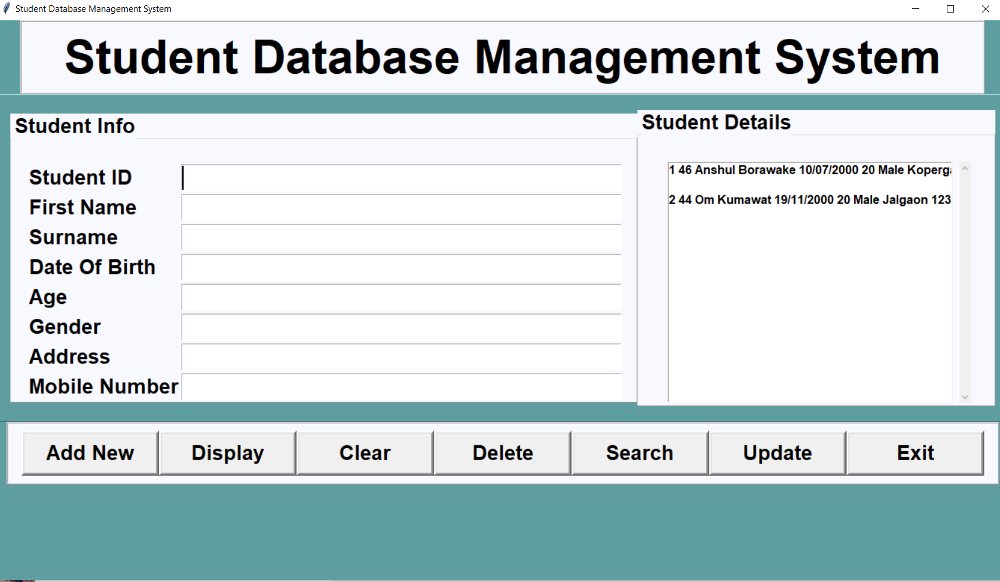

# Student DataBase Management System

Created a student management system to input __student id, first name, surname, date of birth, age, gender, address and mobile__

CRUD application is implemented using SQLite for backend and front UI with tkinter.

__Python Libraries-__

tkinter, tkinter.messagebox and sqlite3

 - Add New
 - Display
 - Clear
 - Delete
 - Search
 - Update
 - Exit

